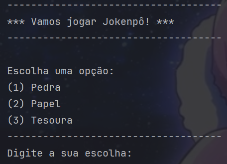
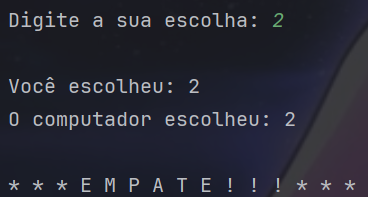
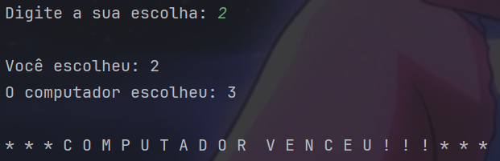

  
 # Jokenpo Com Computador

---

# Introdução
 

Esse programa chamado Jokenpo com computador é um projeto somativo do senai, que visa compreender o nível de entendimento do aluno a respeito de programação.
 Todo o código foi desenvolvido por mim e nele há alguns comentários explicando algumas funcionalidades e objetivos.
 
Aqui apresentarei a parte visual de como funciona o programa, quais resultados devem aparecer e como jogar, sendo apenas uma breve introdução do projeto.

---

# Tela do programa

## Escolha
  No início o programa Jokenpo exibirá as opções de pedra, papel e tesoura e pedirá ao jogador para fazer uma escolha entre 1 à 3 dos respectivos valores mostrados

  

  
  

---

## Resultado
  Após o jogador fazer sua escolha, o programa guardará essa escolha e logo em seguida o computador que é o adversário também fará uma escolha.
   
  Nesse caso, poderá haver três resultados possiveis:

  
  
  

 
Note que, após escolher, o programa exibirá a escolha do jogador e a escolha do computador.
 
O programa segue a lógica do velho jokenpo onde, pedra vence tesoura, tesoura vence papel e papel vence pedra.

---

## Jogar novamente
  Após o resultado, o programa perguntará ao jogador se ele gostaria de jogar novamente, exibindo a opção de escolha entre sim ou não

  
