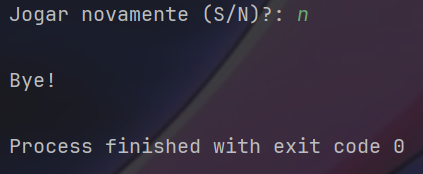
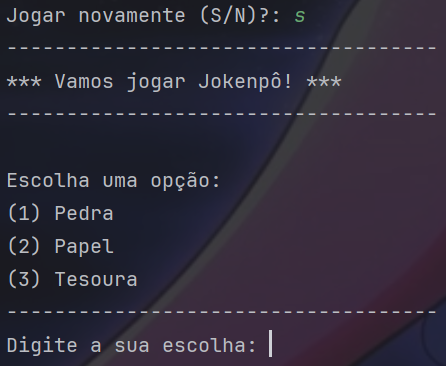
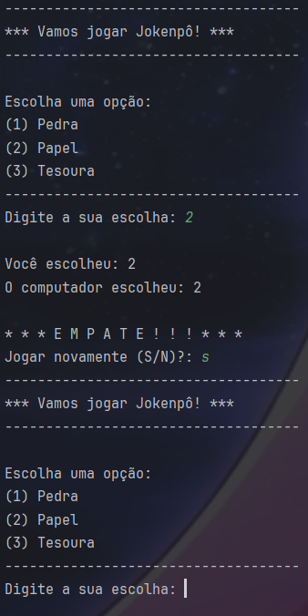

  
 # Jokenpo Com Computador

---

# Introdução
 

Esse programa chamado Jokenpo com computador que será executado no prompt de comando e é um projeto somativo do senai, que visa compreender o nível de entendimento do aluno a respeito de programação.
 Todo o código foi desenvolvido por mim e nele há alguns comentários explicando algumas funcionalidades e objetivos.
 
Aqui apresentarei a parte visual de como funciona o programa, quais resultados devem aparecer e como jogar, sendo apenas uma breve introdução do projeto.

---

# Tela do programa

## Escolha
  No início o programa Jokenpo exibirá as opções de pedra, papel e tesoura e pedirá ao jogador para fazer uma escolha entre 1 à 3 dos respectivos valores mostrados

  

  
  

---

## Resultado
  Após o jogador fazer sua escolha, o programa guardará essa escolha e logo em seguida o computador que é o adversário também fará uma escolha.
   
  Nesse caso, poderá haver três resultados possiveis:

  
  
  

 
Note que, após escolher, o programa exibirá a escolha do jogador e a escolha do computador.
 
O programa segue a lógica do velho jokenpo onde, pedra vence tesoura, tesoura vence papel e papel vence pedra.

---

## Jogar novamente
  Após o resultado, o programa perguntará ao jogador se ele gostaria de jogar novamente, exibindo a opção de escolha entre sim ou não

  

 
  Em caso do jogador não querer jogar de novo, o programa exibirá uma mensagem e finalizará o processo

  

Mas caso o jogador opte por jogar novamente, o programa retornará para a função de obter dados onde pedirá ao jogador para fazer uma nova escolhar e recomeçar o ciclo

  

---

## Finalização
  Para terminar, gostaria de agradecer por voçê ter tirado um tempinho para ver o meu projeto, pois estou começando na vida de programador, esse é um projeto de aprendizagem introduzido pelo meu professor Celso do Senai de Jandira - SP para avaliar o grau de entendimento dos alunos.

  

  

E esse é o programa inteiro finalizado...

---
 

  
[)](https://git.io/typing-svg)

